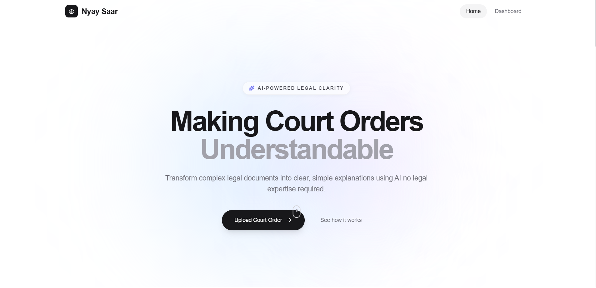
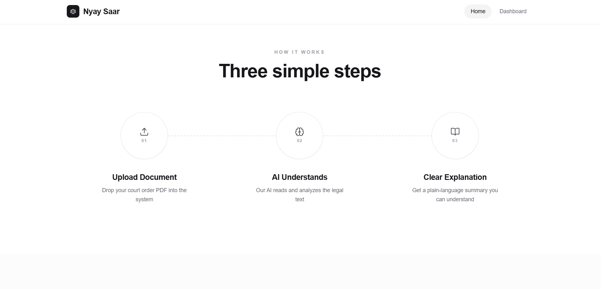
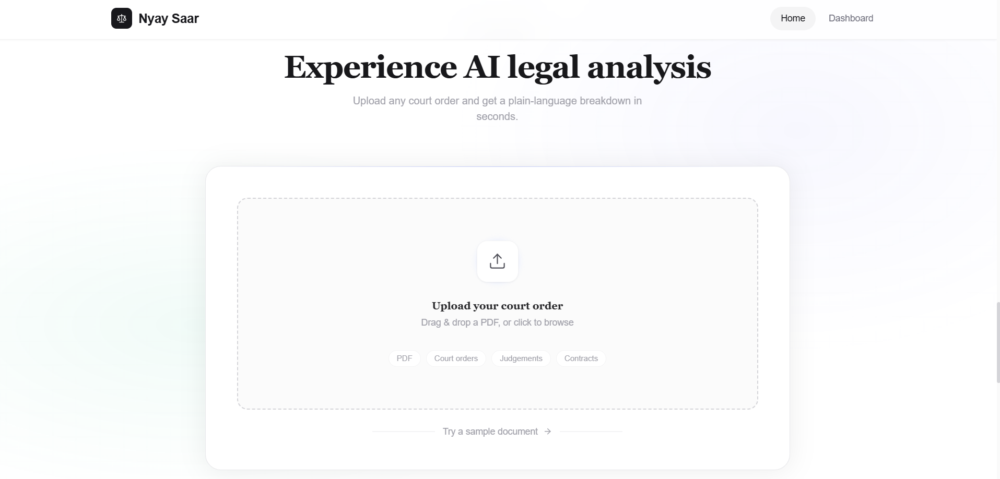
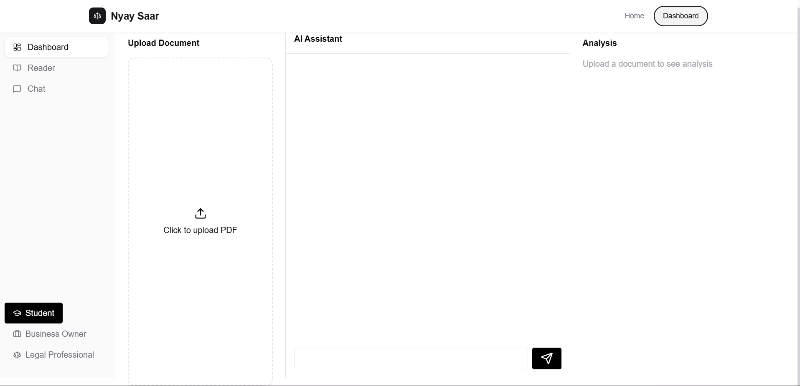

# ⚖️ Nyay Saar — AI-Powered Legal Document Summarizer

<div align="center">


**A full-stack AI application that transforms complex, jargon-heavy court orders into plain-language summaries — accessible to everyone, not just lawyers.**

[Live Demo](#) • [Report Bug](#) • [Request Feature](#)

</div>






---

## 📑 Table of Contents

- [Overview](#-overview)
- [Key Features](#-key-features)
- [RAG Pipeline](#-how-the-ai-works--rag-pipeline)
- [Persona-Based Responses](#-persona-based-responses)
- [Tech Stack](#-tech-stack)
- [System Architecture](#-system-architecture)
- [Getting Started](#-getting-started)
- [API Documentation](#-api-documentation)
- [Project Structure](#-project-structure)
- [Environment Variables](#-environment-variables)
- [Troubleshooting](#-troubleshooting)

---

## 🧭 Overview

**Nyay Saar** (meaning _"Essence of Justice"_ in Hindi) bridges the gap between the legal system and ordinary citizens.

Court orders are written for lawyers — not people. They're filled with Latin phrases, legal citations, and dense paragraphs that make it nearly impossible for a common person to understand their own legal situation without paying for professional help. This creates a massive gap in access to justice, especially for people who can't afford consultations just to _read_ a document.

Nyay Saar fixes that. Upload any court order PDF and within seconds you get a clear, structured summary. You can also **chat directly with the document** — ask things like _"What are my deadlines?"_ or _"What does Section 3 mean?"_ and get instant, human-like answers grounded in your actual document.

---

## ✨ Key Features

| Feature                        | Description                                                                                        |
| ------------------------------ | -------------------------------------------------------------------------------------------------- |
| 📄 **PDF Upload**              | Upload any court order document directly from your device                                          |
| 🧠 **AI Summarization**        | Automatically generates a clear, structured plain-English summary                                  |
| 💬 **Chat with Document**      | Ask natural language questions about the document                                                  |
| 🎭 **Persona-Based Responses** | Explanations tailored to your background — citizen, student, business owner, journalist, or senior |
| 👁️ **Document Viewer**         | Read the original document side-by-side with its explanation                                       |
| ⚡ **Ultra-Fast Inference**    | Powered by Groq — 10–20x faster than standard LLM providers                                        |

---

## 🧠 How the AI Works — RAG Pipeline

Nyay Saar uses **RAG (Retrieval-Augmented Generation)**. Instead of the AI trying to "remember" everything, it first _finds_ the relevant parts of your document, then _generates_ an answer based only on those parts — making responses accurate, fast, and grounded in your actual document.

```
┌─────────────────────────────────────────────────────────────────┐
│                        USER UPLOADS PDF                         │
└──────────────────────────────┬──────────────────────────────────┘
                               │
                               ▼
┌─────────────────────────────────────────────────────────────────┐
│                      TEXT EXTRACTION                            │
│           PDF is parsed and raw text is extracted               │
│                    [ PyMuPDF / pdfplumber ]                     │
└──────────────────────────────┬──────────────────────────────────┘
                               │
                               ▼
┌─────────────────────────────────────────────────────────────────┐
│                       TEXT CHUNKING                             │
│     Long text is split into smaller overlapping chunks          │
│       (500 tokens each with 50 token overlap)                   │
│                    [ LangChain TextSplitter ]                   │
└──────────────────────────────┬──────────────────────────────────┘
                               │
                               ▼
┌─────────────────────────────────────────────────────────────────┐
│                  EMBEDDING GENERATION                           │
│   Each chunk is converted into a vector that captures meaning   │
│                  [ HuggingFace Embeddings ]                     │
└──────────────────────────────┬──────────────────────────────────┘
                               │
                               ▼
┌─────────────────────────────────────────────────────────────────┐
│                    PINECONE VECTOR DB                           │
│        All vectors are stored for fast similarity search        │
└──────────────────────────────┬──────────────────────────────────┘
                               │
              ┌────────────────┴────────────────┐
              │                                 │
              ▼                                 ▼
   ┌──────────────────────┐        ┌────────────────────────┐
   │    AUTO SUMMARY      │        │    USER ASKS A Q       │
   │  Top-ranked chunks   │        │  Query is embedded →   │
   │  sent to LLM for a   │        │  similar chunks fetched│
   │  structured plain-   │        │  from Pinecone via     │
   │  English summary     │        │  vector search         │
   └──────────┬───────────┘        └───────────┬────────────┘
              │                                │
              └──────────────┬─────────────────┘
                             │
                             ▼
┌─────────────────────────────────────────────────────────────────┐
│                   PROMPT CONSTRUCTION                           │
│   Retrieved chunks + user query + selected persona             │
│   combined into a structured prompt  [ LangChain ]             │
└──────────────────────────────┬──────────────────────────────────┘
                               │
                               ▼
┌─────────────────────────────────────────────────────────────────┐
│                   GROQ LLM INFERENCE                            │
│   Prompt sent to Groq's hosted LLM (Llama 3 / Mixtral)         │
│   for ultra-fast generation                                     │
└──────────────────────────────┬──────────────────────────────────┘
                               │
                               ▼
┌─────────────────────────────────────────────────────────────────┐
│                    RESPONSE TO USER                             │
│   Plain-language answer shown in chat / summary panel          │
│   Styled according to selected persona                         │
└─────────────────────────────────────────────────────────────────┘
```

**Why RAG and not just sending the whole document to an AI?**

- Court orders can be 50–200+ pages — too large to send in a single prompt
- RAG finds only the _relevant_ sections, making answers faster and more accurate
- Keeps the AI grounded in your document, reducing hallucinations significantly

---

## 🎭 Persona-Based Responses

One of Nyay Saar's standout features is **Persona Mode** — the AI adjusts _how_ it explains things based on who you are. The same court order means very different things to different people.

### 👨‍⚖️ Common Citizen

**Best for:** Anyone with no legal background

The default mode. Avoids legal jargon entirely. Deadlines and key actions are highlighted in plain, conversational, empathetic language.

> _"The court has ordered that you must vacate the property by March 31st. This means you need to move out before that date or you may face penalties."_

### 🎓 Law Student

**Best for:** Students studying law or professionals in training

Uses proper legal terminology and explains the reasoning behind rulings, along with relevant precedents — ideal for analytical reading.

> _"The court issued an ex-parte injunction under Section 94 CPC, restraining the respondent from alienating the disputed property pendente lite."_

### 💼 Business Owner / Litigant

**Best for:** Companies or individuals directly named in the case

Focuses on business impact, financial obligations, compliance deadlines, and immediate actions needed to avoid further legal consequences.

> _"You are required to pay ₹2,40,000 in damages within 30 days. Failure to comply may result in attachment of your business assets."_

### 📰 Journalist / Researcher

**Best for:** Media professionals, academics, policy researchers

Neutral, factual breakdown suitable for reporting or analysis. Highlights public interest dimensions and broader legal implications.

> _"In a landmark ruling, the court upheld the petitioner's right to information, setting a significant precedent for future RTI-related disputes."_

### 👵 Senior Citizen / Low Literacy

**Best for:** Elderly users or anyone who prefers very simple language

Maximum simplicity — short sentences, no jargon, just the essential facts in the clearest possible way.

> _"The judge said you win. The other person must pay you ₹50,000 within one month."_

---

## 🛠️ Tech Stack

### Frontend

| Technology           | Version | Why We Use It                                   |
| -------------------- | ------- | ----------------------------------------------- |
| **React**            | 18+     | Component-based UI, fast re-renders             |
| **Vite**             | Latest  | Lightning-fast dev server and build tool        |
| **Tailwind CSS**     | 3+      | Utility-first styling, zero custom CSS overhead |
| **Axios**            | Latest  | Clean HTTP requests to the backend API          |
| **React Router**     | 6+      | Client-side multi-page navigation               |
| **React PDF Viewer** | Latest  | Renders PDF documents directly in the browser   |

### Backend

| Technology               | Version | Why We Use It                               |
| ------------------------ | ------- | ------------------------------------------- |
| **FastAPI**              | 0.100+  | High-performance async Python API framework |
| **Python**               | 3.10+   | Core backend language                       |
| **Uvicorn**              | Latest  | ASGI server to run FastAPI                  |
| **PyMuPDF / pdfplumber** | Latest  | Extracts text from uploaded PDFs            |
| **python-dotenv**        | Latest  | Manages API keys via `.env` file            |

### AI / ML Layer

| Technology                 | Role                                                                |
| -------------------------- | ------------------------------------------------------------------- |
| **Groq**                   | Ultra-fast LLM inference — runs Llama 3 / Mixtral models            |
| **LangChain**              | Orchestrates the full RAG pipeline (chunking, retrieval, prompting) |
| **Pinecone**               | Cloud vector database for storing and searching embeddings          |
| **HuggingFace Embeddings** | Converts text chunks into dense numerical vectors                   |

### Why These Specific Tools?

- **Groq over OpenAI** — 10–20x faster inference, critical for a real-time chat experience
- **Pinecone over FAISS/Chroma** — Fully managed, production-ready, scales automatically with no infra to maintain
- **FastAPI over Flask/Django** — Native async support, auto-generated API docs at `/docs`, built-in Pydantic validation
- **LangChain** — Handles the RAG plumbing (text splitters, retrievers, prompt templates) so we build features, not boilerplate

---

## 🏗️ System Architecture

```
┌─────────────┐         ┌──────────────────┐         ┌──────────────────────┐
│   React UI  │ ──────► │  FastAPI Backend  │ ──────► │  Groq LLM (Llama 3)  │
│  (Vite Dev) │ ◄────── │  (Python 3.10+)  │ ◄────── │  via LangChain RAG   │
└─────────────┘         └────────┬─────────┘         └──────────────────────┘
                                  │
                    ┌─────────────┴─────────────┐
                    │                           │
              ┌─────▼──────┐           ┌────────▼───────┐
              │  Pinecone  │           │  HuggingFace   │
              │  VectorDB  │           │  Embeddings    │
              └────────────┘           └────────────────┘
```

---

## 🚀 Getting Started

> **Prerequisites — make sure these are installed before you begin:**
>
> - [Node.js](https://nodejs.org/) v18+ — for the frontend
> - [Python](https://www.python.org/) v3.10+ — for the backend
> - [Git](https://git-scm.com/) — to clone the project

### Step 1 — Clone the Repository

```bash
git clone https://github.com/your-username/nyay-saar.git
cd nyay-saar
```

### Step 2 — Configure Environment Variables

```bash
cd backend
cp .env.example .env
```

Open `.env` and fill in your API keys:

```env
GROQ_API_KEY=your_groq_api_key_here
PINECONE_API_KEY=your_pinecone_api_key_here
PINECONE_ENV=your_pinecone_environment       # e.g. us-east-1-aws
PINECONE_INDEX=nyay-saar
```

> **Where to get keys:**
>
> - Groq → [console.groq.com](https://console.groq.com) _(free tier available)_
> - Pinecone → [app.pinecone.io](https://app.pinecone.io) _(free tier available)_

### Step 3 — Set Up the Backend

```bash
cd backend
python -m venv .venv

# Activate:
source .venv/bin/activate       # macOS / Linux
.venv\Scripts\activate          # Windows

pip install -r requirements.txt
uvicorn app.main:app --reload
```

✅ Backend running at `http://localhost:8000`  
📖 Interactive API docs at `http://localhost:8000/docs`

### Step 4 — Set Up the Frontend

Open a **new terminal** (keep the backend running):

```bash
cd frontend
npm install
npm run dev
```

✅ Frontend running at `http://localhost:5173` — open it in your browser and you're good to go! 🎉

---

## 📡 API Documentation

| Method | Endpoint       | Description                                    |
| ------ | -------------- | ---------------------------------------------- |
| `POST` | `/api/upload`  | Upload a PDF court order for processing        |
| `GET`  | `/api/summary` | Retrieve the auto-generated summary            |
| `POST` | `/api/chat`    | Send a question and get a context-aware answer |
| `GET`  | `/api/health`  | Health check endpoint                          |

Full interactive docs available at `http://localhost:8000/docs` (Swagger UI) when the backend is running.

---

## 📁 Project Structure

```
nyay-saar/
├── frontend/                  ← React + Vite app (the UI)
│   └── src/
│       ├── components/        ← Reusable UI pieces (chat, PDF viewer, persona selector)
│       ├── pages/             ← Full pages (Home, Document view)
│       └── services/          ← API calls to the backend (axios)
│
├── backend/                   ← FastAPI app (the AI engine)
│   └── app/
│       ├── routes/            ← API endpoints (upload, summarize, chat)
│       ├── services/          ← Core logic (PDF parsing, RAG pipeline, LLM calls)
│       └── models/            ← Request/response Pydantic schemas
│
├── .gitignore
└── README.md
```

---

## 🔐 Environment Variables

| Variable           | Required | Description                                               |
| ------------------ | -------- | --------------------------------------------------------- |
| `GROQ_API_KEY`     | ✅ Yes   | API key from [console.groq.com](https://console.groq.com) |
| `PINECONE_API_KEY` | ✅ Yes   | API key from [app.pinecone.io](https://app.pinecone.io)   |
| `PINECONE_ENV`     | ✅ Yes   | Your Pinecone environment (e.g. `us-east-1-aws`)          |
| `PINECONE_INDEX`   | ✅ Yes   | Name of your Pinecone index (e.g. `nyay-saar`)            |

---

## 🧪 Quick Test

Once both servers are running:

1. Open `http://localhost:5173`
2. Upload a PDF court order (or any legal document)
3. Select a **persona** that matches your background
4. Wait a few seconds for the AI to process it
5. Read the plain-English summary on the right panel
6. Use the chat box to ask questions like _"What are my deadlines?"_ or _"Who filed this case?"_

---

## 🛠️ Troubleshooting

| Issue                                | Fix                                                                   |
| ------------------------------------ | --------------------------------------------------------------------- |
| `pip` not found                      | Use `pip3` instead                                                    |
| `npm` not found                      | Install Node.js from [nodejs.org](https://nodejs.org)                 |
| Backend fails to start               | Verify all keys in `.env` are correct and not empty                   |
| Pinecone connection error            | Check `PINECONE_ENV` and index name match your Pinecone dashboard     |
| Port already in use                  | Run on a different port: `uvicorn app.main:app --port 8001`           |
| Virtual env won't activate (Windows) | Run `Set-ExecutionPolicy RemoteSigned` in PowerShell as Administrator |
| PDF upload fails                     | Ensure the PDF is not password-protected or corrupted                 |
| Chat gives wrong answers             | Re-upload the document — it may not have been indexed correctly       |

---

<div align="center">

Made with ❤️ to make justice more accessible.

</div>
